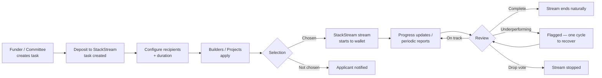
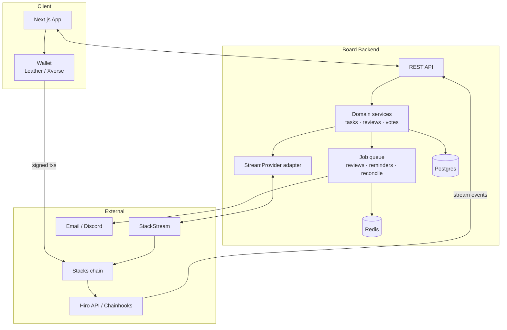

# StackStream Bounty Board

A non-custodial front end for [StackStream](https://stackstream.xyz) that turns lump-sum bounties, grants and accelerator stipends into **continuous payment streams** on Stacks.

The board never holds user funds. Deposits live on StackStream; the board is the interface that creates tasks, maps human decisions (selection, approval, committee votes) onto StackStream's `start` / `pause` / `stop` primitives, and indexes stream state back into a UI that funders, builders and committees can read at a glance.

---

## Table of contents

- [Why this exists](#why-this-exists)
- [Prior art: Flow State](#prior-art-flow-state)
- [Non-custodial by design](#non-custodial-by-design)
- [Product types](#product-types)
- [Core flows](#core-flows)
- [Committee and review process](#committee-and-review-process)
- [StackStream integration](#stackstream-integration)
- [Worked example](#worked-example)
- [Architecture](#architecture)
- [Data model](#data-model)
- [API surface](#api-surface)
- [External interfaces](#external-interfaces)
- [Build phases](#build-phases)
- [Open questions](#open-questions)

---

## Why this exists

Lump-sum payouts are a bad fit for open-ended work. A funder either pays up front and loses leverage, or pays on completion and asks the builder to carry the cost of their own time. Streaming payments solve this: value accrues continuously while work happens, and can be halted the moment it stops.

StackStream already provides the streaming rail on Stacks. What it lacks is a **user-facing marketplace layer** — a place where funders post work, builders find it, and a review loop decides whether a stream keeps running. That layer is this board.

The goal is one reusable front end that works equally well for a one-week freelance task and a three-month ecosystem growth program.

---

## Prior art: Flow State

This product is a deliberate port of [**Flow State**](https://www.flowstate.network/), the mechanic GoodDollar uses to run its builder grant programs on Celo.

The Flow State model, in short:

- A cohort of **already-deployed products** is selected for a fixed program length (~3 months).
- Each project receives a **streamed stipend** for the duration, rather than a milestone-gated grant.
- Projects are measured on **real product activity** — users onboarded, transaction count, volume, retention — not on promises or deliverables.
- The cohort meets on a **fixed cadence** (biweekly). Each project reports what shipped and how the numbers moved.
- Streams continue for projects that are growing. Projects that stall are flagged, then cut.

This is proven, not speculative. Naming it explicitly is a strength in the pitch: *"this mechanic works on Celo, here is the Stacks version, running on StackStream's rail."* The contribution here is the port and the marketplace surface, not the invention of the mechanic.

**What we change from Flow State:** we add a second, lighter product type (single-deliverable bounties) that runs over the same backend, and we make the whole thing non-custodial by pushing fund custody onto StackStream.

---

## Non-custodial by design

**This is the most important architectural property of the product. It should survive every future design decision.**

The board:

- ✅ Creates and configures tasks
- ✅ Constructs deposit transactions for the funder to sign
- ✅ Requests stream `start` / `pause` / `stop` against StackStream
- ✅ Indexes and displays stream state
- ✅ Stores off-chain metadata: descriptions, applications, reports, votes, reputation

The board **never**:

- ❌ Takes custody of funder deposits
- ❌ Operates an escrow contract
- ❌ Holds a balance that could be drained
- ❌ Sits between StackStream and the builder's wallet

Funds move **StackStream → builder wallet**. The board is a control surface beside that path, never on it.

### What this buys us

| Risk | Status |
|---|---|
| Escrow contract exploit | Not applicable — no escrow contract exists |
| Board insolvency / rug | Not applicable — board holds no balance |
| Money-transmission exposure | Substantially reduced — no custody |
| Audit surface | Limited to the adapter and permission model |
| Funds stuck if board goes down | Streams continue on StackStream independently |

### What this costs us

The board cannot enforce anything by holding money. Every enforcement action — stopping a dropped project's stream — depends on **delegated authority on StackStream**. See [Stream authority](#stream-authority), which is the single largest open integration question.

---

## Product types

| | **Task / Bounty Stream** | **Cohort Accelerator Program** |
|---|---|---|
| **Who posts** | Any founder, DAO, protocol or company | Program committee (curated intake) |
| **Who receives** | One builder or small team | N pre-selected, already-live Stacks products (e.g. 5) |
| **Duration** | Funder-set (e.g. 1–2 weeks) | Funder-set program length (typically 1–3 months) |
| **Amount** | Funder-set, per task | Pooled stipend per project, streamed evenly |
| **Success metric** | Deliverable submitted and accepted | Product activity: users onboarded, tx count, volume, retention |
| **Review cadence** | Once, at submission | Biweekly report + biweekly cohort meeting (configurable) |
| **Stream control** | Start on selection; pause/stop on stall or cancellation | Start at kickoff; pause on flag, stop on drop vote |
| **Decision maker** | The funder | The committee, by vote |

Both types share the same spine — **post → deposit → configure → apply → select → stream → review → end**. They differ only in posting flow, review cadence and who holds the stop trigger. This is why they ship as two front-end flows over one backend.

---

## Core flows

### Task creation (funder)

The ordering here is deliberate: **the deposit is what creates the task.** There are no funded-looking-but-empty tasks sitting on the board, and no draft state that can be mistaken for live.

```
1. Connect wallet (Leather / Xverse)
2. Enter task metadata
     - title
     - description
     - success criteria
     - skill tags
     - total amount
     - token (STX / sBTC / SIP-010)
3. Click "Deposit"
     → board constructs the deposit transaction
     → funder signs in wallet
     → deposit lands on StackStream
     → THIS CREATES THE TASK and binds it to a stream
4. Configure the stream (post-deposit)
     - recipient address(es) — one, or many
     - stream duration (funder's choice: weeks for a bounty,
       1–3 months for a cohort)
     - allocation: even split across recipients, or custom per recipient
     - review cadence
5. Task goes live / cohort kicks off
```

Between steps 3 and 4 the task exists and is funded but not yet streaming. This is the only window in which the funder can walk away cleanly, and it should be short and obvious in the UI.

### Task lifecycle (state machine)

```
DRAFT ──deposit tx submitted──► FUNDING_PENDING
                                     │ tx confirmed
                                     ▼
                                  FUNDED ──configure──► OPEN
                                                          │ recipients selected
                                                          ▼
                                                       ACTIVE ◄──┐
                                                       │  │  │   │ recovered
                                                       │  │  └──► FLAGGED
                                                       │  │          │ second failed review
                                                       │  │          ▼
                                                       │  │       DROPPED  (stream stopped)
                                                       │  │
                                                       │  └──────► CANCELLED (stream stopped early)
                                                       │
                                                       └─────────► COMPLETED (stream ran to term)
```

Terminal states: `COMPLETED`, `DROPPED`, `CANCELLED`. Every transition writes an immutable audit-log row with actor, timestamp, reason and — where applicable — the StackStream transaction it produced.

### Builder flow — Task / Bounty

1. Browse open bounties; filter by amount, duration, token, skill tag.
2. Apply with a short proposal, or claim directly if the bounty is first-come.
3. On selection, the stream to the builder's wallet starts automatically for the set duration.
4. Submit progress updates and the final deliverable through the board.
5. Stream runs to term. Completed bounty is recorded on the builder's board profile (reputation history).

> **Note on "approval":** because payment tracks *elapsed time*, not acceptance, funder approval does not gate the money. It gates **reputation credit** and closes the task cleanly. A funder who believes work has stalled must `pause` or `stop` — that is the real lever. The UI must not imply otherwise.

### Builder flow — Cohort

1. Apply to the cohort (or be invited) with product details and current traction.
2. If selected, the stream begins at kickoff for the full program duration.
3. Every two weeks, submit a structured report **before** the cohort meeting.
4. Attend the review; present results, answer committee questions.
5. If flagged, get one review cycle to course-correct.
6. If still underperforming at the next review, the committee votes. On a drop vote the stream stops and the project exits.
7. If retained, continue to the end of the program.

### Shared spine



The review loop (H → I) runs **once at submission** for a bounty and **every two weeks** for a cohort. That is the entire structural difference between the two products.

---

## Committee and review process

> **All drop/continue decisions are made by a human committee, never automatically by the platform.**
> The board's role is to surface data and execute the decision. It does not decide.

### Composition

Committee membership is a governance decision, not a product one, and can be finalised after the mechanic is proven. The expected shape for the first cohort:

- 1–2 StackStream founders/representatives
- 1–2 board maintainers
- 1+ independent Stacks ecosystem representative

Rules to settle before the first program launches (not before building):

- Quorum and vote threshold for a drop
- Conflict-of-interest recusal — a member may not vote on a project they are affiliated with
- Term length and replacement process

### Biweekly report

Submitted by each project before the meeting. Structured fields, not prose, so they can be charted over time:

| Field | Type |
|---|---|
| Users onboarded this period | number |
| Total transactions this period | number |
| Transaction volume this period | number + token |
| Retention / activity delta vs. prior period | percentage |
| What shipped | text + links |
| Next period's plan | text |
| Blockers | text (optional) |

### Two-strike drop mechanism

1. **Review N** — committee reviews the report. Metrics flat or declining → project is **flagged** and given one review cycle to course-correct. **The stream keeps running while flagged** — a flag is a warning, not a penalty. The only stream action the committee ever takes is `stop`, on a drop vote.
2. **Review N+1** — committee reviews again.
   - Improved → flag cleared, project continues normally.
   - Still underperforming → committee votes.
3. **On a drop vote** — the stream is stopped and the project exits the cohort.

On a biweekly cadence, one grace cycle means a project can be flat for roughly four weeks before being cut. That is deliberate — it protects a team from being cut over one bad fortnight (illness, a mid-flight pivot, a delayed launch) while keeping real pressure on sustained non-performance.

**Watch the cadence on short programs.** With biweekly reviews, a one-month program has only two review points — a project flagged at the first review cannot be cut until the second, which is the end of the program. For programs under two months, either shorten the review cycle to weekly or accept that the two-strike mechanism is effectively advisory. The board should warn the funder at configure time when the chosen duration and cadence leave fewer than three review cycles.

**The report is the audit trail behind every drop decision.** Disputes point at a record, not at what someone remembers being said on a call.

---

## StackStream integration

The board is a **client** of StackStream. It introduces no new streaming primitives and needs no rate-adjustment or event-gated streaming — `start` / `pause` / `stop` covers every case in this document.

| Primitive | Triggered by |
|---|---|
| `start` | Builder selected (bounty) · Cohort kickoff (cohort) |
| `pause` | Funder pauses a stalled bounty · Committee flags a project |
| `stop` | Committee drop vote · Funder cancellation · Natural completion at term |

Note that **`pause` is never used by the committee.** Flagging does not pause a stream (see [Two-strike](#two-strike-drop-mechanism)), so the only committee-driven stream action is `stop` on a drop vote. `pause` exists solely for the funder-side bounty cooling-off case.

### Settled: one deposit, many streams

A single deposit funds **N parallel streams**. When a cohort of five projects is accepted, one deposit backs five simultaneous streams to five wallets, each running for the funder-set duration.

Consequences for the design:

- The funder enters a **total amount** and an **allocation model** — even split across recipients, or a custom per-recipient amount. Even split is the default.
- Recipients are attached **after** the deposit, at the configure step. The deposit does not need to know who the recipients are.
- Stopping one recipient's stream does not touch the others. The unstreamed remainder of a dropped project stays with the funder on StackStream.
- The board tracks one `deposit_ref` with many `stream_ref`s beneath it, which is why `streams` is a separate table keyed to both `task_id` and `participant_id`.

### Adapter design

StackStream's concrete API shape is not yet settled (see [Open questions](#open-questions)). To avoid blocking on it, **all StackStream access goes through a single adapter behind a stable interface.** Nothing else in the codebase knows whether the call is a contract call, a REST request or a webhook.

```ts
interface StreamProvider {
  // Build an unsigned deposit tx for the funder to sign client-side.
  buildDeposit(params: {
    amount: bigint;
    token: TokenId;
    funder: StacksAddress;
    memo: TaskRef;
  }): Promise<UnsignedTransaction>;

  // One deposit funds one or many parallel streams.
  // A bounty passes a single recipient; a cohort passes the whole selected set.
  startStreams(params: {
    depositRef: DepositRef;
    durationSeconds: number;
    recipients: Array<{
      address: StacksAddress;
      amount: bigint;
    }>;
  }): Promise<StreamRef[]>;

  pauseStream(ref: StreamRef, reason: ControlReason): Promise<TxRef>;
  resumeStream(ref: StreamRef): Promise<TxRef>;
  stopStream(ref: StreamRef, reason: ControlReason): Promise<TxRef>;

  getStreamStatus(ref: StreamRef): Promise<{
    state: 'active' | 'paused' | 'stopped' | 'completed';
    disbursed: bigint;
    remaining: bigint;
    ratePerSecond: bigint;
    startedAt: number;
    endsAt: number;
  }>;
}
```

Two implementations from day one:

- `MockStreamProvider` — in-memory, time-simulated. Lets the entire product be built and demoed before the real integration exists.
- `StackStreamProvider` — the real adapter, filled in once the interface is agreed with the StackStream team.

### Stream authority

**This is the critical unresolved question and the first thing to align on with StackStream.**

Because the board holds no funds, it cannot enforce a drop by withholding money. Stopping a dropped project's stream requires permission on StackStream. Three possible models:

| Model | How it works | Trade-off |
|---|---|---|
| **A. Funder-triggered** | Board surfaces the vote; funder signs the stop tx | Simplest; no new permissions. But the committee's vote is *advisory* — enforcement depends on the funder acting. |
| **B. Delegated authority** | Funder grants the board (or a committee multisig) stop authority at deposit time | Committee decisions are enforceable. Requires StackStream to support a delegated controller. |
| **C. Committee multisig as funder** | The cohort pool is deposited by a committee-controlled multisig | Fully enforceable, no new StackStream feature needed. Heavier setup; only viable for cohorts, not open bounties. |

**Recommendation:** ship bounties on **A** (the funder is the decision maker there anyway, so advisory-vs-enforceable does not arise), and run the first cohort on **C** to avoid blocking on a StackStream feature request. Pursue **B** as the durable answer once the mechanic is proven.

### Stream irreversibility

State this in the UI, plainly, at deposit time:

> **Streamed funds are final.** Pausing or stopping a stream halts *future* disbursement only. Value already streamed to a builder's wallet cannot be recovered by the funder, the committee or the board.

This is inherent to streaming payments, and it is the honest framing of what a funder is agreeing to. Every dispute mechanism in the product operates on the *unstreamed remainder* and nothing else.

### Dispute handling (bounty flow)

A funder pausing a bounty at 90% completion to avoid paying is the obvious attack. Mitigations, in order of implementation cost:

1. **Pause is time-boxed.** A paused bounty stream auto-resumes after N days (default 7) unless the funder stops it outright. Pausing is a cooling-off action, not an indefinite freeze.
2. **Stops are public.** Every stop is recorded on the funder's board profile with the reason and the percentage streamed at the time. Funders who routinely stop late build a visible history.
3. **Escalation.** A builder can escalate a stop to the committee. The committee cannot reverse the stop — the funds are the funder's — but its ruling is recorded on both profiles.

Reputation is the enforcement mechanism here, not custody. That is a direct consequence of being non-custodial and should be designed for, not apologised for.

---

## Worked example

Cohort length is set by the funder. This example uses **12 weeks**, 5 projects, **$1,200 streamed per project** (~$100/week), biweekly reviews at weeks 2, 4, 6, 8, 10, 12. All five streams are funded by **a single deposit**.

| Project | Wks 1–4 | Wks 5–8 | Wks 9–12 | Outcome | Streamed |
|---|---|---|---|---|---|
| **A** | Growing | Growing | Growing | Graduates | $1,200 (full) |
| **B** | Flat (flagged wk 4) | Recovered by wk 6 | Growing | Graduates | $1,200 (full) |
| **C** | Growing | Flat (flagged wk 8) | Still flat → dropped wk 10 | Dropped | ~$1,000 |
| **D** | Flat from wk 2 (flagged) | Still flat → dropped wk 4 | — | Dropped early | ~$400 |
| **E** | Growing | Growing | Growing | Graduates | $1,200 (full) |

**Result:** 5 enter, 3 graduate on a full stream, 2 are cut by committee vote after failing to recover within their grace cycle. **~$2,000 of the $6,000 pool goes unstreamed.**

### Policy on unstreamed funds

Because the board is non-custodial, unstreamed funds simply remain with the funder on StackStream. The committee must set policy **before launch**, not case-by-case:

- **Return to funder** (default, and the simplest)
- **Top-up bonus** — redistributed as a graduation bonus to surviving projects
- **Roll forward** — reserved for the next cohort round

The same mechanic applies whether the metric is user onboarding, transaction volume, or a funder-set deliverable. The report-and-vote loop does not change — only what counts as "growing."

### A note on amounts

The figures above are illustrative. Be careful about pilot-scale numbers: a $300 stipend over three months is ~$25/week, which does not justify biweekly reporting and a standing committee meeting. **Process overhead must not exceed the incentive.** Either fund at a level where the reporting burden is proportionate, or cut the cadence for smaller programs.

---

## Architecture

### System overview



### Frontend

**Stack:** Next.js (App Router) · TypeScript · Tailwind CSS · TanStack Query · Zustand (local UI state) · `@stacks/connect` + `@stacks/transactions` · Recharts (metric charts)

| Surface | Contents |
|---|---|
| **Public** | Landing · Browse bounties (filter by amount, duration, token, skill) · Browse cohorts · Task detail · Public builder profile |
| **Funder** | Create task wizard · Deposit + sign · Configure stream (recipients, duration, allocation) · Applicant review · Active stream dashboard · Pause/stop controls |
| **Builder** | Application form · My streams (live disbursed/remaining) · Submit progress update · Submit biweekly report · Notifications |
| **Committee** | Cohort dashboard · Per-project metric trend charts · Report review queue · Flag/drop vote UI · Meeting agenda generator · Decision audit log |
| **Shared** | Wallet connect · Live stream progress component (client-side interpolated from rate × elapsed) · Transaction status toasts |

**Key frontend concerns:**

- **Live stream display.** Do not poll for a number that changes every second. Fetch `ratePerSecond` + `startedAt` + `state` and interpolate client-side; reconcile against the server on an interval (~30 s) and on tab focus.
- **Transaction lifecycle.** Stacks confirmations are slow. Every signed action needs an explicit pending state, a mempool-visible link, and a durable "we are waiting on confirmation" UI that survives a page refresh.
- **Wallet-first auth.** No passwords. Sign-in is a signed message (nonce + domain + timestamp) exchanged for a session JWT.
- **The deposit-creates-task step is the highest-stakes screen in the product.** It should be a dedicated, uninterruptible flow with a clear review-before-sign summary.

### Backend

**Stack:** Node.js + TypeScript · Fastify (or NestJS if the team prefers structure) · Postgres + Prisma · Redis + BullMQ · Zod for validation · Pino for logs

**Modules:**

| Module | Responsibility |
|---|---|
| `auth` | Wallet signature verification, nonce issuance, JWT sessions, role resolution |
| `tasks` | Task CRUD, lifecycle state machine, funding confirmation |
| `applications` | Apply, shortlist, select, reject, notify |
| `streams` | Wraps `StreamProvider`; owns start/pause/resume/stop; persists stream refs |
| `reports` | Structured report submission, validation, period windowing, history |
| `reviews` | Review cycles, flag state, vote collection, quorum/threshold resolution |
| `committee` | Membership, roles, recusal rules |
| `reputation` | Derived profile stats for builders and funders |
| `indexer` | Chainhook/webhook receiver; reconciles on-chain stream state into the DB |
| `notifications` | Email + Discord fan-out; report-due and meeting reminders |
| `audit` | Append-only event log for every state transition and stream control action |

**Cross-cutting rules:**

- **The DB is a cache of chain truth, never the source of it.** Any stream state shown in the UI is reconciled against `getStreamStatus`. A periodic reconcile job catches missed webhooks.
- **Every stream control action is idempotent** and keyed by an operation id, so a retried request cannot double-stop or double-start.
- **Every state transition writes to `audit_log`.** No exceptions — this is what makes drop decisions defensible.
- **Committee votes are append-only.** A vote is never updated in place; a changed mind is a new row.

### Jobs and scheduling

| Job | Cadence | Purpose |
|---|---|---|
| `reconcile-streams` | every 5 min | Pull `getStreamStatus` for all active streams; correct drift |
| `open-review-window` | per cohort schedule | Open the report window ahead of each biweekly meeting |
| `report-due-reminder` | T-48h, T-12h | Nudge projects with unsubmitted reports |
| `close-review-window` | per cohort schedule | Lock reports, generate the meeting agenda |
| `auto-resume-paused` | hourly | Resume bounty streams paused longer than the cooling-off window |
| `finalize-completed` | hourly | Mark streams that reached term as `COMPLETED` |

---

## Data model

```
users
  id · stacks_address · display_name · bio · avatar_url · roles[] · created_at

tasks
  id · type (bounty|cohort) · funder_id · title · description · success_criteria
  skill_tags[] · token · total_amount · duration_seconds · review_cadence
  status · deposit_tx_id · deposit_ref · created_at · funded_at · started_at · ended_at

participants                    -- a builder or project attached to a task
  id · task_id · user_id · role (builder|project) · allocation_amount
  status (applied|selected|active|flagged|dropped|completed) · joined_at · exited_at

applications
  id · task_id · user_id · proposal · product_url · current_traction (jsonb)
  status (pending|shortlisted|selected|rejected) · created_at

streams
  id · task_id · participant_id · provider_ref · recipient_address
  amount · rate_per_second · state · disbursed · started_at · ends_at · last_synced_at

reports
  id · participant_id · period_start · period_end
  users_onboarded · tx_count · tx_volume · retention_delta
  shipped · next_plan · blockers · submitted_at

review_cycles
  id · task_id · sequence · window_opens_at · window_closes_at · meeting_at · status

reviews                          -- one committee decision per participant per cycle
  id · review_cycle_id · participant_id · outcome (on_track|flagged|dropped)
  rationale · decided_at

votes
  id · review_id · committee_member_id · value (continue|flag|drop) · note · cast_at

stream_events                    -- indexed from chain / provider
  id · stream_id · kind (started|paused|resumed|stopped|completed)
  tx_id · block_height · disbursed_at_event · observed_at

audit_log
  id · actor_id · entity_type · entity_id · action · before (jsonb) · after (jsonb)
  reason · tx_ref · created_at
```

---

## API surface

```
POST   /auth/nonce                      issue signing nonce
POST   /auth/verify                     verify signature → session JWT

GET    /tasks                           browse; filters: type, status, token, amount, tags
POST   /tasks                           create draft (pre-deposit)
GET    /tasks/:id
POST   /tasks/:id/deposit/build         → unsigned deposit tx
POST   /tasks/:id/deposit/confirm       broadcast tx id → FUNDING_PENDING
POST   /tasks/:id/configure             recipients, duration, allocations → OPEN
POST   /tasks/:id/cancel                stop all streams, terminal

POST   /tasks/:id/applications          apply
GET    /tasks/:id/applications          funder/committee only
POST   /applications/:id/select         → starts stream
POST   /applications/:id/reject

GET    /streams/:id                     live status (reconciled)
POST   /streams/:id/pause               funder or committee, with reason
POST   /streams/:id/resume
POST   /streams/:id/stop                with reason; terminal

POST   /participants/:id/reports        submit period report
GET    /participants/:id/reports        history, charted in UI

GET    /tasks/:id/review-cycles
POST   /review-cycles/:id/votes         committee only
POST   /review-cycles/:id/finalize      resolve votes → flag/drop/continue, execute stream action

GET    /users/:address/profile          reputation: completed, dropped, stops issued
GET    /tasks/:id/audit                 public decision trail

POST   /webhooks/chainhook              stream event ingestion (signed)
```

---

## External interfaces

| Interface | Purpose | Status |
|---|---|---|
| **StackStream** | Deposit, stream start/pause/stop, stream status | **Shape unresolved.** Abstracted behind `StreamProvider`; `MockStreamProvider` unblocks all other work. |
| **Stacks wallets** (Leather, Xverse) | Auth signatures, deposit and control tx signing | Standard — `@stacks/connect` |
| **Hiro Stacks API** | Transaction confirmation, address/balance lookups | Standard |
| **Chainhooks** | Push stream/contract events to the board indexer | Standard; needs a signed webhook endpoint |
| **Notifications** | Report-due reminders, selection notices, flag/drop notices | Resend (email) + Discord webhook |
| **Product metrics** (future) | Verify self-reported traction against on-chain data | **Phase 3.** Self-reported at launch; the committee is the check. |
| **Storage** | Report attachments, demo links, screenshots | S3-compatible (R2). Links-only is acceptable for MVP. |

### On metric verification

Reports are self-reported at launch, and the committee is the verification layer — exactly as Flow State runs it. Automated verification of on-chain product activity (indexing a project's own contract for tx count and unique users) is a strong later addition, but it is not a prerequisite. Do not let it block the MVP.

---

## Build phases

### Phase 0 — Foundations
- Repo, CI, environments
- Wallet auth end to end
- `StreamProvider` interface + `MockStreamProvider` with simulated time
- Data model and migrations

### Phase 1 — Bounty flow (MVP)
- Create task → deposit → configure → live
- Browse, filter, apply, select
- Stream start; live progress UI
- Pause (time-boxed) / stop / natural completion
- Submit deliverable, funder acceptance, basic reputation
- **Ship this first.** It proves the deposit→stream path with one recipient and one review point.

### Phase 2 — Cohort flow
- Multi-recipient configuration from a single deposit
- Review cycles, report windows, reminders
- Structured reports + metric trend charts
- Committee dashboard, voting, quorum, recusal
- Two-strike flag/drop, executed against the stream
- Public audit trail

### Phase 3 — Depth
- Real `StackStreamProvider` (if not already landed — pull earlier the moment the interface is agreed)
- Automated on-chain metric verification
- Reputation scoring and funder-side history
- Dispute escalation flow
- Program templates and cohort cloning

---

## Open questions

### Blocking — settle with StackStream before Phase 1 ships

- [ ] **Integration shape.** Does the board call StackStream contracts directly, or request stream operations via API/webhook on the funder's behalf? This determines the `StreamProvider` implementation and nothing else — the rest of the product can be built against the mock in the meantime.
- [ ] **Stream authority.** Can a funder delegate `pause`/`stop` authority to a third party (the board, or a committee multisig) at deposit time? If not, committee drop votes are advisory and we ship the first cohort on model **C** (committee multisig as funder). *See [Stream authority](#stream-authority).*
- [ ] **Stream status exposure.** Does StackStream expose `state`, `disbursed`, `remaining`, `ratePerSecond` in a form the board can read directly — and are there push events (Chainhook-compatible) — or must the board track disbursement itself?
- [ ] **Token support.** STX only, or sBTC and SIP-010 tokens? Stablecoin support materially affects whether real-money programs are viable.

### Product — settle before the first cohort launches

- [ ] **Unstreamed funds policy.** Return to funder (default), graduation bonus, or roll into the next cohort. Decide as policy, not case-by-case.
- [ ] **Committee rules.** Quorum, drop threshold, recusal, term length.
- [ ] **Cooling-off window.** Default auto-resume period for a paused bounty stream (proposed: 7 days).

### Deferred

- [ ] **Fee model.** No fee at launch. Eventually: flat listing fee, percentage of streamed value, or ecosystem-funded. Needs an answer before the board needs to sustain itself.
- [ ] **Gas costs.** Who pays for `start`/`pause`/`stop` transactions — the funder, the board, or the party triggering the action?
- [ ] **Reputation portability.** Should board reputation be exportable or attestable on-chain, rather than living only in the board's DB?

---

## Running locally

```bash
npm install
cp .env.example .env          # set JWT_SECRET and CHAINHOOK_WEBHOOK_SECRET
npm test                      # 31 tests, no database or chain required
```

The default `STREAM_PROVIDER=mock` runs the whole product against
`MockStreamProvider`, which simulates streaming in memory with an injectable
clock. **No Postgres, no Redis, no StackStream account, no testnet funds are
needed to run the test suite** — that is the point of the adapter seam.

To run the API and web app you also need Postgres and Redis:

```bash
npm run db:generate
npm run db:migrate
npm run dev:api               # http://localhost:4000
npm run dev:web               # http://localhost:3000
```

### Repository layout

```
packages/shared     Domain vocabulary and rules: lifecycle state machines,
                    allocation maths, the two-strike resolver, cadence
                    assessment, wire schemas. No I/O — pure and fully tested.
packages/provider   The StackStream seam. StreamProvider interface,
                    MockStreamProvider (simulated time), StackStreamProvider
                    (deliberately unimplemented), and the factory that chooses.
apps/api            Fastify + Prisma. Wallet auth, task lifecycle, selection,
                    stream control, reports, committee voting, audit log, jobs.
apps/web            Next.js. Browse, task detail with live streams, the
                    deposit-creates-task wizard, committee review dashboard.
```

### Where the integration lands

`packages/provider/src/stackstream.ts` is the only file blocked on the
StackStream conversation. Every method throws `NOT_IMPLEMENTED` today. When the
integration shape is agreed, fill in those seven methods and flip
`STREAM_PROVIDER=stackstream` — nothing else in the codebase changes.

---

## Success criteria

The board is working at six months if:

- Bounties are posted by funders the team did not personally recruit
- At least one cohort has run start to finish with a real drop decision executed through the board
- Builders return — a non-trivial share of completed bounties are by repeat participants
- Every drop decision has a report trail that a neutral third party could read and follow
- Zero incidents involving user funds — which the non-custodial design should make structurally true, not merely lucky
